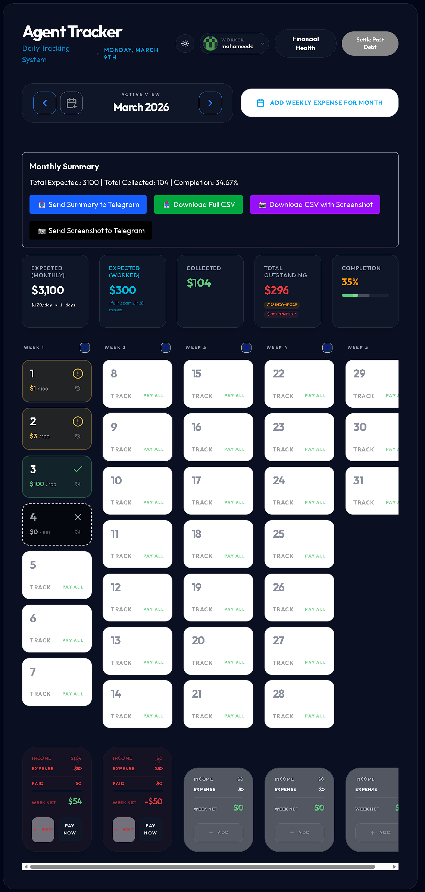

# Agent Expenses Tracker - Frontend

[](https://vitejs.dev/)
[](https://reactjs.org/)
[](https://tailwindcss.com/)
[](https://supabase.com/)

A powerful and intuitive daily payment tracking system designed for small recurring collections. This application supports partial payments, late settlements, and weekly expenses, maintaining a strict audit trail.



## 🚀 Key Features

- **Daily Collection Tracking**: Monitor expected vs. collected amounts with support for Full, Partial, and Missed payment states.
- **Settlement Logic**: Handles late payments for past partials without altering historical records, ensuring data integrity.
- **Weekly Expenses Management**: Track operational costs separately from income.
- **Real-time Summaries**: Instant monthly overviews and weekly income/expense breakdowns.
- **Telegram Integration**: Automated reporting to Telegram channels for stakeholders.
- **Mobile Optimized**: Responsive design that adapts key information for mobile viewing.

## 🛠️ Tech Stack

- **Framework**: [React 19](https://react.dev/)
- **Build Tool**: [Vite](https://vitejs.dev/)
- **Styling**: [Tailwind CSS 4](https://tailwindcss.com/)
- **Language**: [TypeScript](https://www.typescriptlang.org/)
- **Backend-as-a-Service**: [Supabase](https://supabase.com/)
- **Icons**: [Lucide React](https://lucide.dev/)

## 📖 Docs-Driven Development

This project follows a **"Docs-as-Code"** philosophy. The `docs/` directory contains the source of truth for all project logic, UX rules, and data models. AI is used as a collaborative partner to ensure the codebase strictly adheres to these specifications.

## 🏁 Getting Started

### Prerequisites

- [Node.js](https://nodejs.org/) (v18 or higher)
- [npm](https://www.npmjs.com/) or [pnpm](https://pnpm.io/)

### Installation

1. **Clone the repository**:
   ```bash
   git clone <repository-url>
   cd Agent_expenses_traacker/frontend
   ```

2. **Install dependencies**:
   ```bash
   npm install
   ```

3. **Configure Environment Variables**:
   Copy the example environment file and fill in your credentials:
   ```bash
   cp .env.example .env
   ```
   Provide your Supabase URL, Anon Key, and optional Telegram bot details.

4. **Start the development server**:
   ```bash
   npm run dev
   ```

## 📜 Available Scripts

- `npm run dev`: Start the Vite development server.
- `npm run build`: Build the production-ready application.
- `npm run lint`: Run ESLint to verify code quality.
- `npm run preview`: Preview the production build locally.

## 📁 Project Structure

- `src/components`: Reusable UI components.
- `src/hooks`: Custom React hooks for logic and data fetching.
- `src/lib`: External service initializations (Supabase, Telegram).
- `src/pages`: Main application views.
- `src/types`: TypeScript interfaces and types.
- `src/utils`: Helper functions and formatting logic.